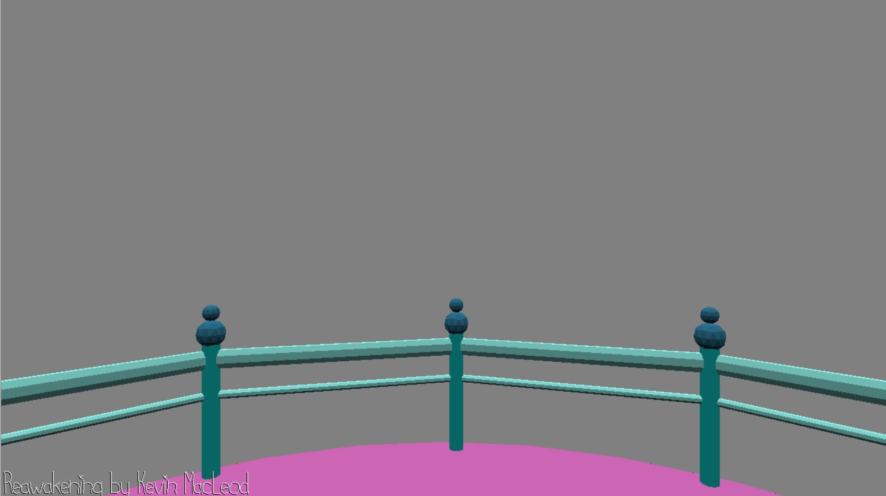

# Incomplete WalkMesh Game

Author: Tyler Thompson

Design: You move about the scene, causing different music to be played when standing on different platforms.

Screen Shot:

How To Play: Move with the WASD keys and look around with the camera.

WalkMesh Code Sources:
I used a Stack Exchange (https://gamedev.stackexchange.com/questions/23743/whats-the-most-efficient-way-to-find-barycentric-coordinates) post that itself used Christer Ericson's Real-Time Collision Detection book.
I also reached out to fellow fellow classmate Dominic Calkosz to ask if he would be willing to share his code and be used as reference, which he agreed to.
Both of these sources are also called out in the code for the code chunks provided by each of them.

Music Sources:
All music comes royalty free from https://incompetech.com/.
"Reawakening" by Kevin MacLeod
"Heart of Nowhere" by Kevin MacLeod
"Time Passes" by Kevin MacLeod

This game was built with [NEST](NEST.md).

NOTE: I just wanted to apologize for how incomplete this game is. I did not manage my time well and I overestimated my abilities. I ended up having to rely on others for most of the WalkMesh code. While I think I now have an understanding of how WalkMeshes work, I did not have time to add much meaningful gameplay on top of it. Again, I want to apologize for my lackluster "game" this round.

